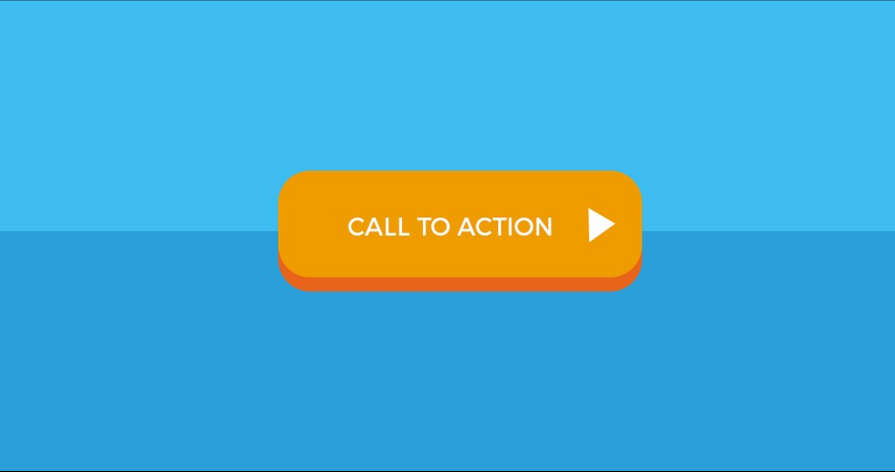
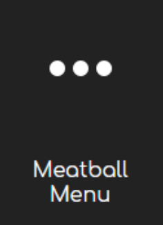
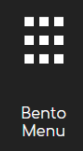
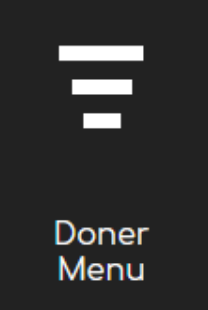

# 2020-01-08, Wednesday

## HTML Begriffe

* cta-button: \

* kebab-menu:\

* meatball-menu:\

* bento menu:\

* doener-filter:\

***

## Darstellung
Stage - grosser Bereich, in dem etwas praesentiert wird\
Header\
paragraph\
Teaser\
footer\
Button\
Input-Sidebar\
unordered list\
nav-bar\
***

## Main tags
span: ohne semantische Bedeutung (bsp. fuer unterschiedliche Farben innerhalb eiens Elements)\
h1 (h2...)\
p (paragraph)\
strong\
em (emphasize)\
small\
mark\
br\
a\
img\
button\
input\
label\
ul\
li\
ol\
hr\
q\
***

## Anmerkungen
lang kann allen tags hinzugefuegt werden. Bsp.: `<article lang="de">`\
ein `<q>` erkennt dann die entsprechenden quotes\
[open Graph](https://ogp.me/) im `<head>` definiert die Darstellung fuer die teilung von links in social media\
`<link>` fuer css\
`<script>` fuer js\
anmerkung: `<defer>` hinter script oder link im gleichen tag, damit zuerst das skript ausgefuehrt wird.

***

## Void Element
input\
img
***

## Emmet
cmd+enter: Zeile runter\
cdm+shift+enter: Zeile hoch\
[Markierung]cmd+D: fuegt cursor hinzu\
main>h1{text}p\
`a[href="link$.html"]{link$}*3` \
lorem: lorem ipsum\
p(>lorem)*3\
aside>h1+ul>li*3^p
***

## CSS
class wird fuer yuordnung von styling verwendet\

id wird niemal sfuer styling verwendet\
`<a href="#register">Register now</a>`\
`<h2 id="register">registration</h2>`\
  verlinkung innerhalb der Seite

<label for="name">Name:</label>\
<input id="name type="text">